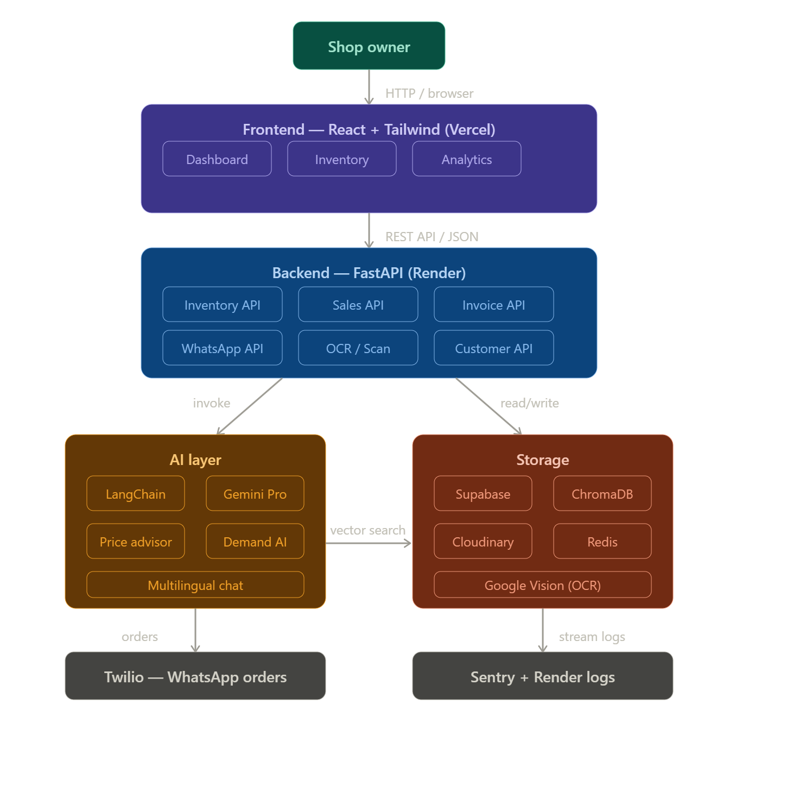

# ShopMind AI — Premium Business OS

ShopMind AI is a high-performance, single-page command center designed for modern e-commerce and business management. Built with a "Light Commerce-AI" aesthetic, it integrates real-time data from Supabase with advanced AI insights via OpenRouter.



## ✨ Core Features

- **Business Intelligence Hero**: A premium 3D glass cube interface with an airy, atmospheric background and smooth scroll-stack card reveals.
- **Real-time Metrics**: High-performance KPI tracking for Revenue, Orders, and AOV, powered by live Supabase synchronization.
- **AI Advisor**: A focused chat interface that uses your actual business data to provide actionable insights on inventory, sales, and customers.
- **Inventory Radar**: Interactive stock monitoring with status-aware scanning effects and low-stock alerts.
- **Sales Analytics**: Dynamic revenue visualization and product leaderboard with hardware-accelerated entrance animations.
- **Customer Ledger**: Comprehensive profile management with spending analysis and tiered intelligence.
- **Unified Data Entry**: Streamlined forms for rapid business updates.

## 🚀 Performance Optimized

- **Single-Page Scroll**: Seamless section-to-section navigation with zero-lag smooth scrolling.
- **Efficient Rendering**: Custom `IntersectionObserver` logic ensures heavy 3D visuals and charts only render when visible.
- **Hardware Acceleration**: All animations are optimized to use only `transform` and `opacity`, ensuring 60fps performance on high-resolution displays.
- **Theme Engine**: Integrated Dark Mode with automatic variable transitions for a premium experience in any lighting.

## 🛠 Tech Stack

- **Frontend**: React, Tailwind CSS, Recharts, Lucide, Lenis (Smooth Scroll)
- **Backend**: Python (FastAPI), Supabase Edge Functions
- **Database**: Supabase (PostgreSQL)
- **AI**: OpenRouter (Gemini 1.5 Pro)

## 📦 Setup & Installation

1. **Frontend**:
   ```bash
   cd frontend
   npm install
   npm run dev
   ```
2. **Backend**:
   ```bash
   cd backend
   pip install -r requirements.txt
   python main.py
   ```
3. **Environment**:
   Ensure `VITE_SUPABASE_URL` and `VITE_SUPABASE_ANON_KEY` are configured in your `.env` for full data connectivity.

---
*Created with passion for high-performance business tools.*
